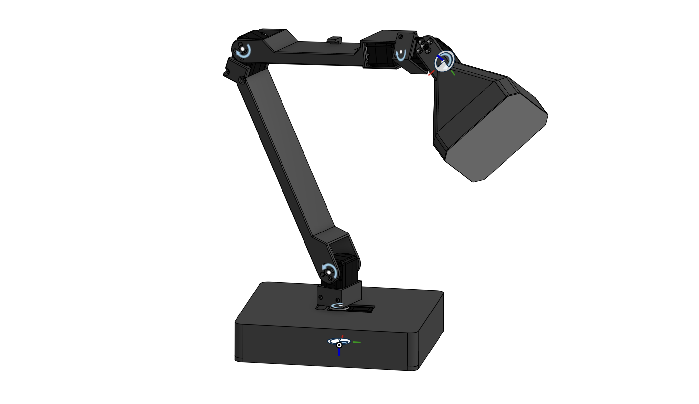
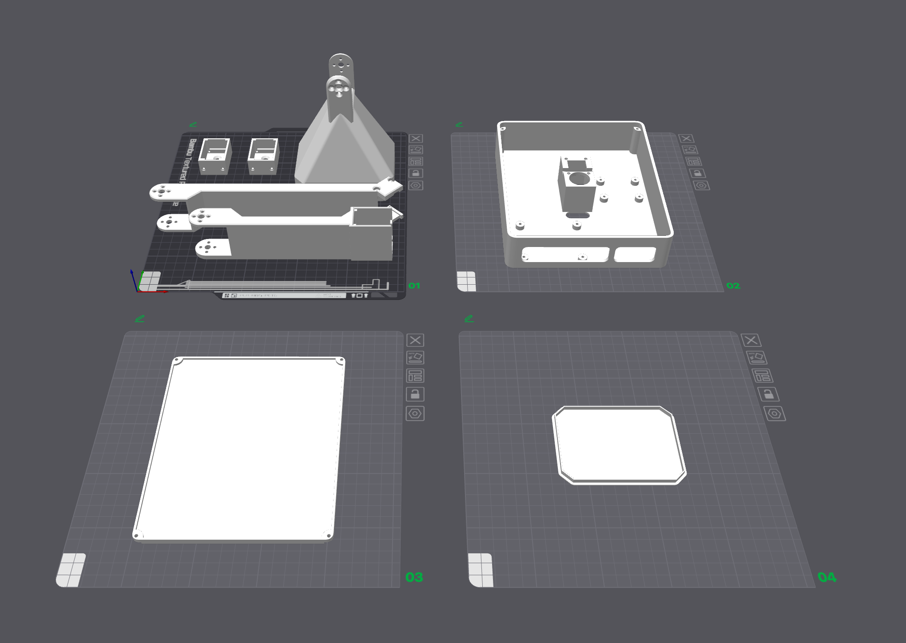

# 3D Print

You can find the .3mf files for 3D printed parts of LeLamp inside `/3D/`. You can also view it in [OnShape](https://cad.onshape.com/documents/16c9706360b5ad34f9c8db49/w/2edfa54c83253c120fbc9e58/e/a7196194821d9cfe2842a44a?renderMode=0&uiState=68a066a8be10690aa3429850).

To build your LeLamp, you need to print the following parts:

- **1x Lamp Base**: Contains servo driver and a normal pi.
- **1x Lamp Base Cover**: Cover lamp base.
- **1x LampArm (Base to Elbow)**: Contains base pitch and elbow pitch servo.
- **1x LampArm (Elbow to Wrist)**: Contains elbow pitch and wrist roll servo.
- **2x LampArm (Pitch)**: Contains base pitch or wrist pitch servo.
- **1x Lamp Head**: Contains led matrix and speaker.
- **1x Lamp Head - Diffuser**: Diffuse LED Matrix.

## Print Orientation And Settings

For the optimal print orientation and order, you can reference the following image.

For optimal print setting, you can follow the default setting of your preferred printer. Here are some general notes:

- **Filament**: PLA
- **Layer Height**: 0.2mm
- **Infill Density**: 15%
- **Enabled Support**: Yes
- **Support Type**: Tree type

---

**Previous**: [Prerequesites](./0.%20Prerequisites.md) | **Next**: [Electronics](./2.%20Electronics.md)
