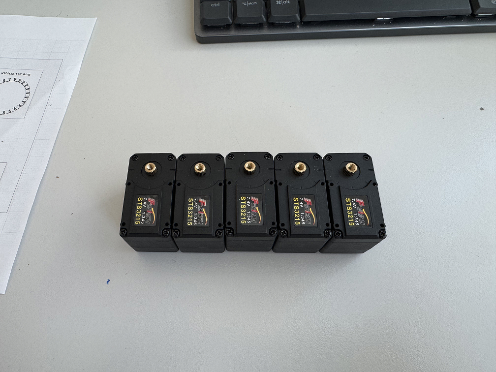
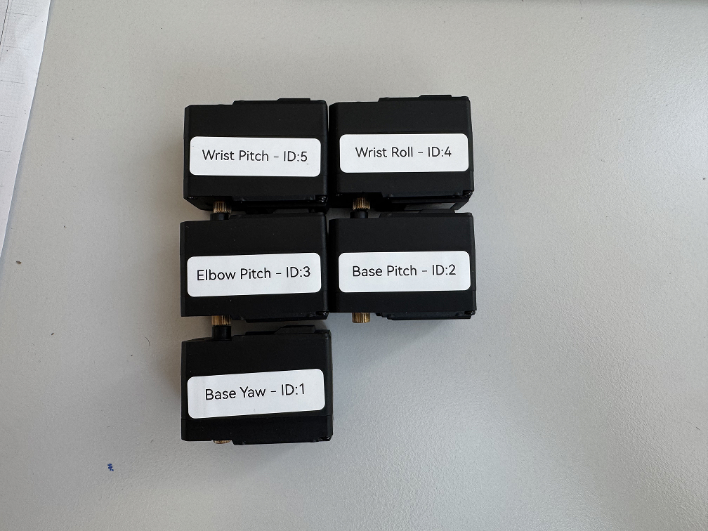
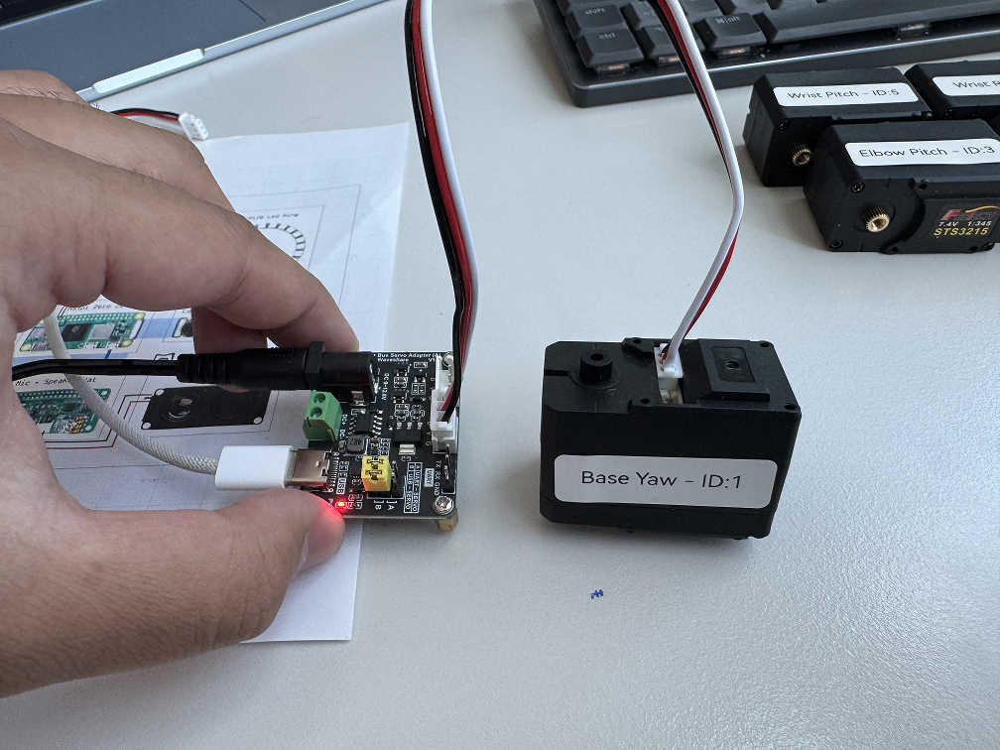

# Servo Setup

**⏱️ Estimated time:** 30-45 minutes  
**🔧 Required tools:** Computer, servo driver, USB cable  
**📦 Required components:** 5x STS3215 servos, servo driver board

The first part of assembling LeLamp is setting up your servos.

## 0. Download LeLamp Runtime on your computer

On your personal computer, using the CLI terminal of your choice, clone the [LeLamp's Runtime Repository](https://github.com/humancomputerlab/lelamp_runtime):

```sh
git clone https://github.com/humancomputerlab/lelamp_runtime
cd lelamp_runtime
```

Install uv:

```bash
curl -LsSf https://astral.sh/uv/install.sh | sh
```

Then setup the runtime by:

```bash
uv sync
```

In later part of this tutorial, you will have to setup LeLamp's runtime again, but on your Raspberry Pi.

## 1. Unbox and lay your servos on a table.



## 2. Label your servos.



| Servo Name  | Servo ID |
| ----------- | -------- |
| base_yaw    | 1        |
| base_pitch  | 2        |
| elbow_pitch | 3        |
| wrist_roll  | 4        |
| wrist_pitch | 5        |

Based on the table above, you should label your servo accordingly. There's no particular order to this or specific servo you should label with a certain ID.

The end result is having 5 servos, each with a label that tells you which is which.

## 3. Run LeLamp's motor setup script.

This step should be done on your personal computer or laptop.



Connect the servo driver to your computer and figure which port it is connected to.

Inside `lelamp_runtime`, you can find port this by running:

```bash
uv run lerobot-find-port
```

For motor setup, inside `lelamp_runtime`, run the following command and connect the servo accordingly:

```bash
uv run -m lelamp.setup_motors --id your_lamp_name --port port_your_servo_driver_is_connected_to
```

Example:

```bash
uv run -m lelamp.setup_motors --id lelamp --port /dev/tty.usbmodem5A680114681
```

Remember the name you set for your lamp, you will use it again in the future.

## Success Criteria

After completing servo setup, you should have:

- [ ] 5 servos labeled with their intended positions
- [ ] All servos responding correctly to commands
- [ ] Servo IDs properly configured (1-5)
- [ ] Motor setup script completed successfully

## Troubleshooting

**Common issues:**

- **Servo not detected**: Check USB connection and port
- **Permission errors**: May need `sudo` or add user to dialout group
- **Servo ID conflicts**: Ensure each servo has unique ID

---

**Previous**: [3D Print](./1.%203D%20Print.md) | **Next**: [Lamp Assembly](./3.%20LeLamp%20Assembly.md.md)
