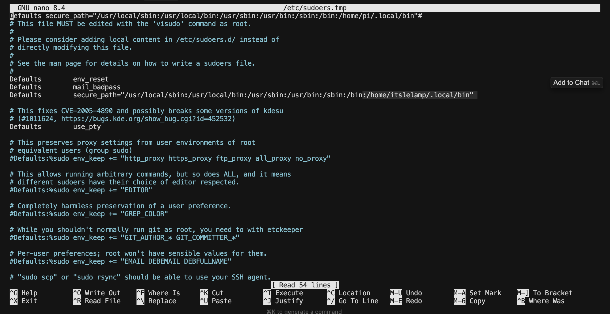

# 🛠️ LeLamp Runtime Setup Guide

**⏱️ Estimated time:** 1–2 hours
**🔧 Required tools:** Computer, USB cable, SD Card Reader
**📦 Required components:** Raspberry Pi, SD Card

## 1. OS

Using [Pi Imager](https://www.raspberrypi.com/software/), flash **Raspberry Pi OS Lite (64-bit)** onto your Raspberry Pi. You can reference how to do this [here](https://www.raspberrypi.com/documentation/computers/getting-started.html).

In this tutorial, we used the Debian Bookworm version (released 2025-05-13).

When prompted to configure the settings on your pi, remember to:

- Set the Wifi SSID and password.
- Set the username and password.
- Set the hostname
- Enable SSH

## 2. Runtime

**Important Note:** As a common practice, review the output of each command carefully after running. Do as you are instructed within each command and their output.

After successfully flashing your pi, SSH into it by running the following command:

```bash
ssh your_username@your_host_name.local
```

Then you need to set up [LeLamp Runtime](https://github.com/humancomputerlab/lelamp_runtime):

```bash
git clone https://github.com/humancomputerlab/lelamp_runtime.git
```

To use LeLamp's runtime, install uv:

```bash
curl -LsSf https://astral.sh/uv/install.sh | sh
```

Install the necessary dependencies for audio:

```bash
sudo apt-get install portaudio19-dev
```

To setup the runtime:

```bash
cd lelamp_runtime
uv sync --extra hardware
```

This will take a while.

## 3. Setup Mic and Speaker

If you use the ReSpeaker Hat for Raspberry Pi, you can reference their tutorial [here](https://wiki.seeedstudio.com/respeaker_2_mics_pi_hat_raspberry_v2/).

For convenience, the tutorial is below:

1. Get Device Tree Source (DTS) for the ReSpeaker 2-Mics Pi HAT (V2.0), compile it and install the device tree overlay.

   ```bash
   curl https://raw.githubusercontent.com/Seeed-Studio/seeed-linux-dtoverlays/refs/heads/master/overlays/rpi/respeaker-2mic-v2_0-overlay.dts -o respeaker-2mic-v2_0-overlay.dts
   dtc -I dts respeaker-2mic-v2_0-overlay.dts -o respeaker-2mic-v2_0-overlay.dtbo
   sudo dtoverlay respeaker-2mic-v2_0-overlay.dtbo
   sudo cp respeaker-2mic-v2_0-overlay.dtbo /boot/firmware/overlays
   ```

2. Edit /boot/firmware/config.txt:

   ```bash
   sudo tee -a /boot/firmware/config.txt >/dev/null <<'EOF'
   dtoverlay=respeaker-2mic-v2_0-overlay
   dtoverlay=i2s-mmap
   EOF
   ```

3. Edit sudo's sound config:

```bash
sudo tee /etc/asound.conf > /dev/null <<'EOF'
# Default capture & playback device = Seeed 2-Mic
pcm.!default {
    type plug
    slave {
        pcm "hw:3,0"      # input/output device (Seeed 2-Mic)
    }
}

ctl.!default {
    type hw
    card 3
}
EOF
```

4. Reboot your device:

   ```bash
   sudo reboot
   ```

5. Check if your device is enabled:

   ```bash
   aplay -l
   ```

   The expected output should be like this:

   ```bash
   card 2: seeed2micvoicec [seeed2micvoicec], device 0: 1f000a4000.i2s-tlv320aic3x-hifi tlv320aic3x-hifi-0 [1f000a4000.i2s-tlv320aic3x-hifi tlv320aic3x-hifi-0]
   Subdevices: 1/1
   Subdevice #0: subdevice #0
   ```

   Afterwards, you can set up the sound level with the following command:

   ```bash
   alsamixer
   ```

   Inside alsamixer, you can F6 to select device `seeed2micvoicec`. The audio setting to be edited is `Line`, `Line DAC`, `PCM`. This audio setting can be muted by default, which you can unmute by typing `M` when selecting `Line`. You should set the volume level to 100 on the first try.

## 4. Test functionalities

### RGB

For RGB, run the following command with sudo:

```bash
sudo uv run -m lelamp.test.test_rgb
```

In case you can't find uv as root, run:

```bash
which uv
```

Then replace uv with the output, for example:

```bash
sudo /home/pi/.local/bin/uv run -m lelamp.test.test_rgb
```

If you don't want to do this long path every single time, you can add the path to uv to sudo's secure path:

```bash
sudo visudo
```



Add the following `/home/pi/.local/bin` (Remember to change your username):

```bash
Defaults secure_path="/usr/local/sbin:/usr/local/bin:/usr/sbin:/usr/bin:/sbin:/bin:/home/<your_user_name_here>/.local/bin"
```

### Mic and Speaker

For Mic and Speaker, run the following command:

```bash
uv run -m lelamp.test.test_audio
```

### Servo

Connect Pi to the servo driver through the USB port, then run the following to find which port the servo is connected to:

```bash
uv run lerobot-find-port
```

You need to unplug your USB during this process to find which port the servo is connected to. Most likely it is `/dev/ttyACM0`.

Then run the following command to check whether the servos are available:

```bash
uv run -m lelamp.test.test_motors --id your_lamp_name --port port_your_servo_driver_is_connected_to
```

## Assembly Completion Checklist

After completing lamp setup, verify:

- [ ] All the above test pass

## What You Should Have

At this stage, you should have:

- **A functional LeLamp**.

---

**Previous**: [LeLamp Assembly](./3.%20LeLamp%20Assembly.md) | **Next**: [LeLamp Control](./5.%20LeLamp%20Control.md)
